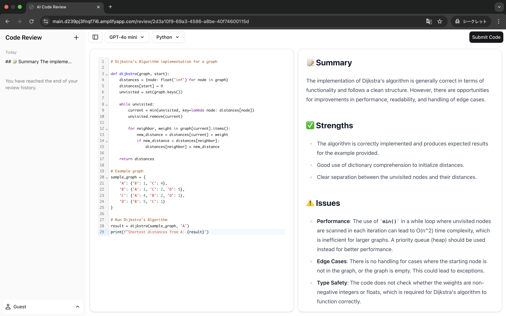

# 🤖 AI Code Review - Frontend

A modern frontend application for **AI-powered code reviews**, built with **Next.js App Router** and designed for performance, scalability, and developer experience.

## ⚙️ Technology Stack & Features

- ⚡ **Next.js (App Router)**
  - Advanced file-based routing for scalability
  - **React Server Components (RSCs)** & **Server Actions** → faster rendering and reduced client bundle size

- 🎨 **UI & Styling**
  - **shadcn/ui** for modern, reusable components
  - **Tailwind CSS** for utility-first, responsive design
  - **Radix UI primitives** ensuring accessibility and flexibility

- 🔐 **Authentication & Security**
  - **Auth.js** for seamless login flows
  - **JWT (JSON Web Token)** for secure session management

- 🧪 **Testing & Quality Assurance**
  - **Jest** + **React Testing Library** for reliable unit testing
  - **Playwright** for full End-to-End browser testing

- 🚀 **DevOps & Deployment**
  - **GitHub Actions** for automated CI/CD pipelines
  - **AWS Cloud** deployment for scalability & availability

- 🌙 **User Experience Enhancements**
  - Dark mode support
  - Fast, responsive, and mobile-friendly UI

## 📸 Screenshots

### 🔍 AI Code Review



### 🔐 Authentication Flow


## 🛠️ Running Locally

1. **Set environment variables**

   Copy the example file and update with your values:

   ```
   cp .env.example .env
   ```

2. Install dependencies

   ```
   npm install
   ```

3. Start the development server
   ```
   npm run dev
   ```
   Your app will now be running at [localhost:3000](http://localhost:3000) 🎉
